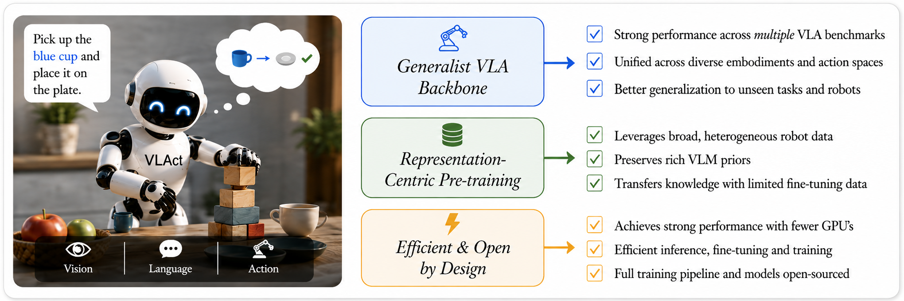
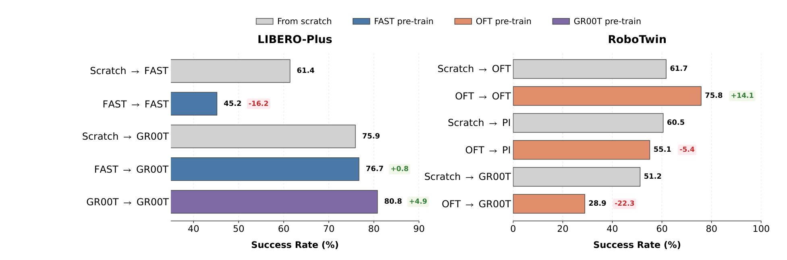
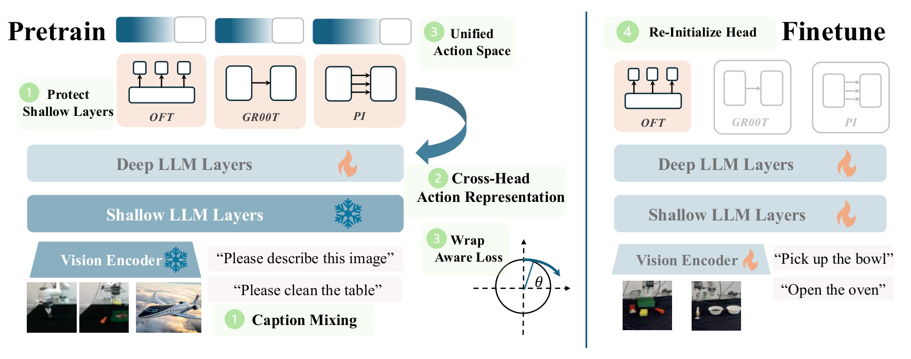
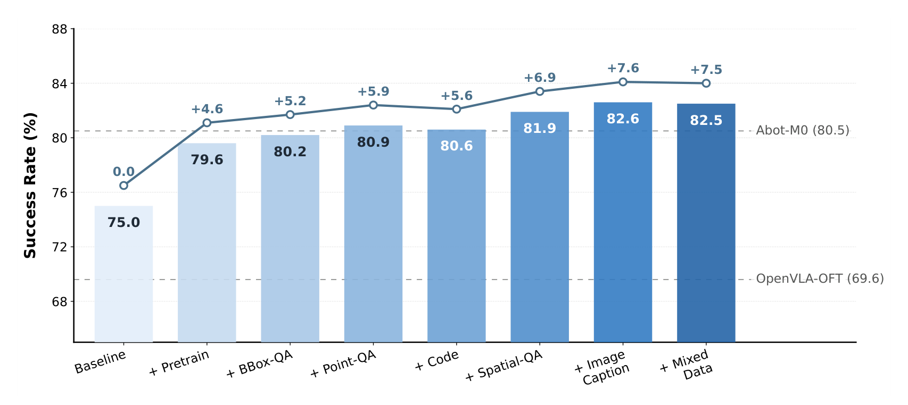
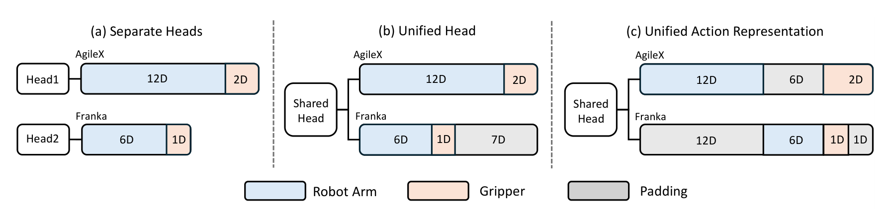
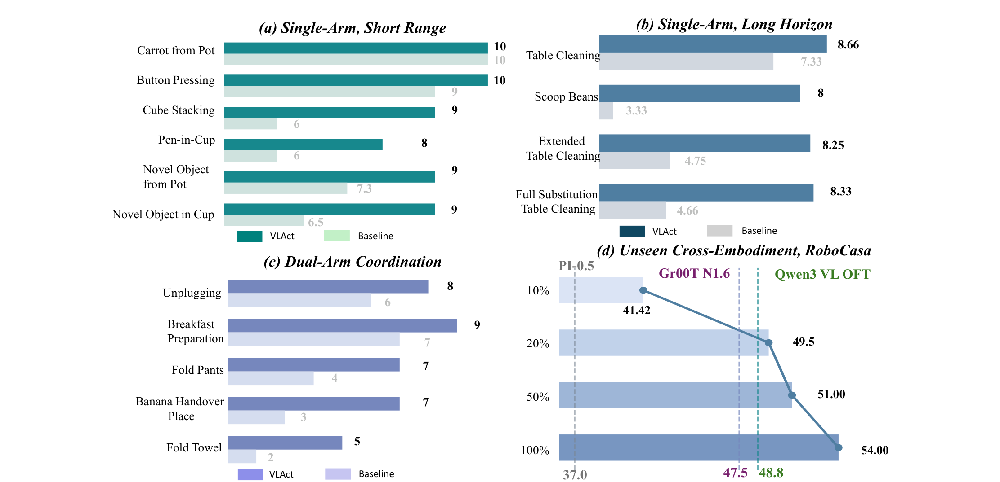

<p align="center">
  
</p>

# Beyond Data Scaling: Representation-Centric Continued Pre-training for Vision-Language-Action Models

[](https://starvla.github.io/VLAct/assets/VLAct.pdf)
[](https://starvla.github.io/VLAct/)
[](https://youtu.be/aTrIbDQ7a2o)
[](https://huggingface.co/collections/StarVLA/vlact-6a903c2e0c176179da425c96)
[](LICENSE)

## TABLE OF CONTENTS

1. [News](#news)
2. [Highlights](#why-vlact)
3. [Method](#method)
4. [Results](#results)
5. [Installation](#installation)
6. [Quick Start](#run-vlact)
7. [Model Zoo](#model-zoo)
8. [Repository Layout](#repository-layout)
9. [Citation](#citation)
10. [Acknowledgements](#acknowledgements)
11. [License](#license)

<a id="news"></a>
## News

- [x] **[2026.08]** The [paper](https://starvla.github.io/VLAct/assets/VLAct.pdf), [code](https://github.com/starVLA/VLAct), [project site](https://starvla.github.io/VLAct/), continued-pretraining backbone, and selected downstream checkpoints are public.
- [x] **[2026.08]** VLAct entered the [RoboDojo leaderboard](https://robodojo-benchmark.com/leaderboard), ranking 6th of 35 policies by success rate and ahead of every explicitly designated world-action model in the August 24 snapshot.

---

**Beyond Data Scaling: Representation-Centric Continued Pre-training for Vision-Language-Action Models [[Paper](https://starvla.github.io/VLAct/assets/VLAct.pdf)]** <br />
<a href="https://senqiaoyang.com/">Senqiao Yang</a><sup>†</sup>,
<a href="https://wcy1122.github.io/">Chengyao Wang</a><sup>†</sup>,
<a href="https://scholar.google.com/citations?user=fyewGpgAAAAJ&amp;hl=en">Yuxin Chen</a>,
<a href="https://vincent2311.github.io/">Zixuan Wang</a>,
<a href="https://scholar.google.com/citations?user=3oMQsq8AAAAJ&amp;hl=en">Longxiang Tang</a>,
<a href="https://haokungui.github.io/">Haokun Gui</a>,
<a href="https://jhuiye.com/">Jinhui Ye</a>,
<a href="https://alanlusun.github.io/">Changsheng Lu</a>,
<a href="https://xywu.me/">Xiaoyang Wu</a>,
<a href="https://scholar.google.com/citations?user=NL6EJ20AAAAJ">Mingkang Zhu</a><br />
**Advisors:**
<a href="https://scholar.google.com/citations?user=lMnVrgIAAAAJ">Pengguang Chen</a>,
<a href="https://scholar.google.com/citations?user=BUEDUFkAAAAJ&amp;hl=en">Shu Liu</a><sup>✉</sup>,
<a href="https://tianzhuotao.github.io/">Zhuotao Tian</a>,
<a href="https://www.cs.hku.hk/~hszhao/">Hengshuang Zhao</a>,
<a href="https://www.cse.cuhk.edu.hk/~byu/">Bei Yu</a>,
<a href="https://jiaya.me/home">Jiaya Jia</a><br />
<sub><sup>†</sup> Project leaders &nbsp;·&nbsp; <sup>✉</sup> Correspondence</sub>

> [!IMPORTANT]
> **TL;DR.** VLAct builds a reusable Qwen3-VL-4B action backbone from open data, reaching **82.6%**
> on LIBERO-Plus, **54.8%** on VLA-Arena, and **92.5%** on RoboTwin 2.0. It also transfers to unseen
> robots: **49.5% with 20% of RoboCasa-GR1 data** and **6th of 35 by success** on RoboDojo's ARX X5.

---

<a id="why-vlact"></a>
## 💡 Why VLAct

Robot trajectories cannot be scraped from the web. They must be produced through embodied execution,
and the space a policy must generalize over — scenes, objects, goals, embodiments, contact dynamics —
is combinatorial and continuous. Even the largest robot datasets are sparse samples of that space.

Data scaling remains essential, but it is not the only axis. Under a **fixed** robot-data budget,
downstream performance also depends on how effectively trajectories are distilled into *reusable
visual-action knowledge* inside the backbone. VLAct treats continued pre-training as representation
learning rather than only action fitting, and the VLM backbone as **a first-order design variable for
VLA**.

<p align="center">
  
</p>

The paper isolates three failure modes of naive VLA continued pre-training through controlled pilot
experiments:

| | Failure mode | Evidence |
| :---: | --- | --- |
| **1** | **Prior erosion** — robot data is far narrower than web-scale corpora, so end-to-end updating overwrites broadly useful vision-language features. | Updating the full backbone: 78.9 on LIBERO-Plus vs. **82.6** with shallow layers protected. |
| **2** | **Decoder lock-in** — a single pre-training head specializes the backbone to that head's decoding geometry. | OFT pre-training lifts OFT fine-tuning 61.7 → 75.8, but drags PI fine-tuning *below* scratch: 60.5 → 55.1. |
| **3** | **Discretization loss** — discrete action tokens teach coarse structure but lose fine-grained temporal and amplitude information. | FAST → FAST reaches only 45.2 on LIBERO-Plus, while FAST → GR00T reaches 76.7. |

> [!IMPORTANT]
> VLAct addresses all three **during continued pre-training**. Downstream, you discard the pre-training
> heads, attach a freshly initialized head of your choice, unfreeze the full backbone, and fine-tune
> normally. Across every comparison against the matched Qwen3-VL-OFT baseline, the VLM backbone
> weights are the only thing that changes: the downstream head, its initialization, data, optimizer,
> and budget are identical. The resulting gains are therefore attributable to the learned backbone
> representation.

---

<a id="method"></a>
## 🧩 Method

<p align="center">
  
</p>

### 1 · Preserve the VLM prior

Freeze the **vision encoder and the lower half of the LLM layers** (*shallow-layer protection*), and
mix **image-caption data** into every minibatch: `L_total = L_action + 0.5 · L_VLM-CE`. Lower layers
carry broad visual and spatial processing; captions supply dense supervision over objects,
attributes, relations, and scene context, keeping the trainable layers near their original operating
regime.

<details>
<summary><b>📊 Ablations — freezing strategy and auxiliary data</b></summary>
<br>

| Pre-training update strategy | LIBERO-Plus | RoboTwin 2.0 |
| --- | :---: | :---: |
| Update full backbone | 78.9 | 77.1 |
| Freeze vision encoder only | 81.3 | 79.3 |
| **Freeze vision encoder + lower ½ LLM** | **82.6** | **80.5** |

<p align="center">
  
</p>

Every tested non-action source helps under a fixed budget, and image captions help most. Even
*text-only* instruction data improves over robot-only training, supporting the view that auxiliary
co-training helps preserve and diversify the representation rather than only transferring task-specific
knowledge.

</details>

### 2 · Diversify the action supervision

Attach **three continuous heads — OFT, PI, and GR00T — to one shared latent**, all predicting the
same ground-truth chunk: `L_action = L_OFT + L_PI + L_GR00T`. No new head, no alignment module; head
diversity *is* the supervision. Because the heads impose different decoder biases on the same
problem, the backbone cannot lean on features only one of them can read. All heads share a single
backbone forward pass, so the cost is a few lightweight decoders, not repeated backbone compute.

<details>
<summary><b>📊 Ablations — head transfer and same-head adaptation</b></summary>
<br>

PI as the downstream head (RoboTwin 2.0):

| Pre-training heads | PI seen in pre-training | PI fine-tune | Δ vs. scratch |
| --- | :---: | :---: | :---: |
| None | – | 60.5 | – |
| OFT | No | 55.1 | −5.4 |
| OFT + GR00T | No | 63.1 | +2.6 |
| OFT + PI + GR00T | Yes | **77.0** | **+16.5** |

Adding a second head flips an *unseen* downstream head from below scratch to above it. And head
diversity does not cost same-head performance — it improves it: OFT 78.8 → **80.5**, PI 75.4 →
**77.0**, GR00T 71.7 → **76.0** over matched single-head pre-training.

</details>

### 3 · Unify action semantics across embodiments

<p align="center">
  
</p>

One shared head over a **partially unified 20-D action layout**: dims 1–12 are the two 6-DoF arms of
bimanual embodiments (absolute joint angles), dims 13–18 the single-arm 6-DoF delta end-effector
pose, dim 19 the **shared gripper coordinate** (Franka's gripper and AgileX's left gripper), dim 20
the right gripper. Each sample contributes loss only on its active dimensions; the rest are masked.
Physically comparable dimensions share supervision, incompatible kinematics are never force-aligned,
and no embodiment adapter, router, or conditioned decoder is introduced.

For periodic joints we add a **wrap-aware loss** so that 179° and −179° are 2° apart rather than
358°: `δ_wrap = ((â − a) + π) mod 2π − π`, applied to absolute joint dimensions only.

<details>
<summary><b>📊 Ablations — action layout and wrap-aware loss</b></summary>
<br>

| Action-space design | RoboTwin 2.0 | LIBERO-Plus |
| --- | :---: | :---: |
| Separate embodiment-specific heads | 78.5 | 81.1 |
| Unified head (no alignment) | 79.5 | 81.4 |
| **Unified action representation** | **80.5** | **82.6** |

| Setting | Unified joint space | Wrap loss | RoboTwin 2.0 |
| --- | :---: | :---: | :---: |
| Baseline (raw joint angles) | | | 75.5 |
| Unified joint space | ✓ | | 78.6 |
| **+ Wrap-aware loss** | ✓ | ✓ | **80.5** |

</details>

---

<a id="results"></a>
## 📊 Results

Comparisons against the matched Qwen3-VL-OFT baseline are controlled: the downstream action head and
its initialization, data, optimizer, and fine-tuning budget are fixed, while only the backbone weights
change. Published systems provide broader context but may use different training recipes. RoboDojo is
an external leaderboard result, so metrics should not be compared across benchmarks.

| Benchmark | VLAct | Matched Qwen3-VL-OFT baseline | Improvement |
| --- | ---: | ---: | ---: |
| LIBERO-Plus | **82.6%** | 75.0% | **+7.6** |
| VLA-Arena | **54.8%** | 33.4% | **+21.4** |
| RoboTwin 2.0 Base, Clean | **80.5%** | 61.7% | **+18.8** |
| RoboTwin 2.0 Scaling, Clean / Random | **92.5% / 90.8%** | 88.2% / 88.3% | **+4.3 / +2.5** |
| DOMINO, SR / MS | **18.50 / 34.20** | 10.86 / 30.49 | **+7.64 / +3.71** |

The backbone also transfers to robots absent from continued pre-training. VLAct reaches **49.5%** on
RoboCasa-GR1 using only 20% of the downstream trajectories and **54.0%** with the full set. On the
official RoboDojo evaluation for ARX X5, it records a **10.66** average score and **7.60%** success
rate, ranking **6th of 35 policies by success** in the August 24, 2026 snapshot.

<details>
<summary><b>Real-robot results on Franka Research 3</b></summary>
<br>

<p align="center">
  
</p>

| Evaluation regime | VLAct | Baseline |
| --- | :---: | :---: |
| Single-arm short-horizon, in-domain | **92.5%** | 77.5% |
| Novel object from pot / in cup | **90.0% / 90.0%** | 73.3% / 65.0% |
| Table cleaning / scoop beans | **86.6% / 80.0%** | 73.3% / 33.3% |
| Long-horizon OOD: extended / full substitution | **82.5% / 83.3%** | 47.5% / 46.6% |
| Dual-arm coordination | **72.0%** | 44.0% |

Each policy is fine-tuned for 50K steps on 8 H800 GPUs and evaluated over 10 fixed initial
configurations per task. VLAct and the baseline use the same demonstrations, head, optimizer, and
fine-tuning budget.

</details>

---

<a id="installation"></a>
## 🛠 Installation

Tested workflows assume Linux, Python 3.10, NVIDIA GPUs, and a CUDA-compatible PyTorch build.

```bash
git clone https://github.com/starVLA/VLAct.git
cd VLAct

conda create -n vlact python=3.10 -y
conda activate vlact

# Install a CUDA-compatible PyTorch build first, following pytorch.org.
python -m pip install -r requirements.txt
python -m pip install flash-attn==2.7.4.post1 --no-build-isolation
python -m pip install -e .
```

<details>
<summary><b>flash-attn troubleshooting</b></summary>
<br>

FlashAttention must match your CUDA toolkit and PyTorch versions. `--no-build-isolation` resolves most
cases; otherwise pick a release matching your setup after checking:

```bash
nvcc -V
python -m pip list | grep -E 'torch|transformers|flash-attn'
```

</details>

<a id="run-vlact"></a>
## 🚀 Run VLAct

### 1 · Continued pre-training

Follow the **[continued pre-training guide](scripts/run_scripts/Pretrain/README.md)** for the complete
pipeline: base-model downloads, VLM and robot-data preparation, LeRobot v2.1 layout, cache and
statistics generation, path configuration, and single- or multi-node training.

```bash
bash   scripts/run_scripts/Pretrain/pretrain_qwen3_single_node.sh   # 8 GPUs, one node
sbatch scripts/run_scripts/Pretrain/pretrain_qwen3_slurm.sh         # multi-node Slurm
```

> [!NOTE]
> The launchers reference a machine-specific Accelerate/DeepSpeed configuration. Review the
> configuration notes in the pre-training guide before launching.

### 2 · Downstream fine-tuning and evaluation

RoboTwin ships OFT, PI, and GR00T variants; the current LIBERO and VLA-Arena launchers use PI, and
the DOMINO launcher uses OFT:

```bash
bash scripts/run_scripts/RoboTwin/train_robotwin_qwen3oft.sh
bash scripts/run_scripts/RoboTwin/eval_robotwin_qwen3oft.sh    # also *_qwen3pi.sh, *_qwen3gr00t.sh

bash scripts/run_scripts/LIBERO/train_libero_qwen3pi.sh
bash scripts/run_scripts/VLA-Arena/train_vla_arena_qwen3pi.sh
bash scripts/run_scripts/DOMINO/train_domino_qwen3oft.sh
```

> [!TIP]
> Every launcher opens with a marked configuration block. Review `base_vlm`, the benchmark data root,
> `run_root_dir`, and `pretrained_ckpt` before launching. The downstream launchers set
> `--trainer.random_init_action_model True`, so the transferred object is the backbone rather than the
> continued-pretraining action heads.

Benchmark environment setup and evaluation protocols live under [`examples/`](examples):
[LIBERO-plus](examples/LIBERO-plus/README.md) · [VLA-Arena](examples/VLA-Arena/README.md) ·
[RoboTwin](examples/Robotwin/README.md) · [DOMINO](examples/DOMINO/README.md) ·
[RoboCasa](examples/Robocasa_tabletop/README.md) · [eval protocol](examples/eval_protocol.md).

### 3 · Recipe → implementation

| Recipe component | Where it lives |
| --- | --- |
| Shallow-layer protection (vision encoder + LLM layers 0–17) | `--trainer.freeze_modules` |
| Caption-mixed co-training | `--datasets.vlm_data.dataset_use`, `--trainer.loss_scale.vlm` |
| Multi-head co-supervision | `--framework.heads oft,gr00t,pi`, `--framework.head_loss_weights` |
| Partially unified action layout | `--framework.disjoint_action_layout`, `--framework.mask_padded_action_dims` |
| Wrap-aware loss | `--trainer.shortest_angular_joint_loss*`, `--trainer.endpoint_wrap_loss_weight` |

All of these are set in
[`pretrain_qwen3_single_node.sh`](scripts/run_scripts/Pretrain/pretrain_qwen3_single_node.sh); the
multi-head framework itself is
[`QwenHybrid_xrobot_padding.py`](starVLA/model/framework/QwenHybrid_xrobot_padding.py).

> [!NOTE]
> **Paper setting vs. released artifact.** The paper defines the auxiliary caption objective with
> weight `0.5` and reports a 16-GPU setup. The checked-in launcher and downloadable 100K-step
> artifact record `--trainer.loss_scale.vlm 0.2`; the artifact card records 4 nodes × 8 GPUs. Use the
> paper for the reported experimental setting and the artifact's `training_config.original.yaml` to
> reproduce that specific checkpoint.

<a id="model-zoo"></a>
## 📈 Model Zoo

The [VLAct collection](https://huggingface.co/collections/StarVLA/vlact-6a903c2e0c176179da425c96)
tracks public releases. For a new embodiment, dataset, or decoder, use the raw continued-pretraining
backbone as the default starting point rather than a benchmark-specific policy.

| Model | Release |
| --- | --- |
| **VLAct Qwen3-VL-4B backbone** |[Weights](https://huggingface.co/StarVLA/VLAct_Qwen3_Pretrain) |
| VLAct RoboDojo | [Weights](https://huggingface.co/StarVLA/VLAct-Qwen3VL4B-OFT-RoboDojo) |
| VLAct RoboTwin 2.0 | [Weights](https://huggingface.co/StarVLA/VLAct_Qwen3GR00T_Robotwin_Finetune) |
| VLAct DOMINO | [Weights](https://huggingface.co/StarVLA/VLAct_Qwen3OFT_Domino_Finetune) |
| VLAct VLA-Arena | [Weights](https://huggingface.co/StarVLA/VLAct_Qwen3PI_VLA_Arena_Finetune) |
| VLAct LIBERO-Plus | [Weights](https://huggingface.co/StarVLA/VLAct_Qwen3PI_Libero_Plus_Finetune) |

Download the reusable backbone together with its resolved config and normalization statistics:

```bash
huggingface-cli download JasonYang66/VLAct-Qwen3VL4B-Pretrained \
  --local-dir playground/Pretrained_models/VLAct-Qwen3VL4B-Pretrained
```

Then set the downstream launcher's `pretrained_ckpt` to:

```text
playground/Pretrained_models/VLAct-Qwen3VL4B-Pretrained/checkpoints/steps_100000_pytorch_model.pt
```

> [!IMPORTANT]
> The continued-pretraining checkpoint is not a directly deployable policy. Keep `config.yaml` and
> `dataset_statistics.json` at the downloaded run root, match the target camera and action contracts,
> and initialize an incompatible downstream action head from scratch.

Checkpoint heads and headline paper results are not interchangeable: RoboTwin's **92.5%** result uses
OFT, while the released RoboTwin checkpoint uses GR00T; the VLA-Arena and LIBERO-Plus model pages use
PI, while Tables 1 and 4 of the paper report OFT comparisons. The paper's RoboDojo result is the official
50-episode-per-task leaderboard snapshot, not a scaled local evaluation.

<a id="repository-layout"></a>
## 🗂 Repository Layout

```text
starVLA/
├── model/framework/QwenHybrid_xrobot_padding.py   # VLAct: shared latent → OFT + PI + GR00T
├── model/framework/{QwenOFT,QwenPI_v4,QwenGR00T}.py
├── model/modules/action_model/                    # action heads + wrap-aware losses
├── dataloader/gr00t_lerobot/                      # mixtures, embodiment tags, action transforms
└── training/train_starvla{,_cotrain}.py           # VLA / VLA+VLM co-training entry points

examples/{DROID,InternA1,MolmoAct,RoboCoin}/       # pre-training data cleaning & cache building
examples/{LIBERO,LIBERO-plus,VLA-Arena,Robotwin,DOMINO,Robocasa_tabletop}/
scripts/run_scripts/{Pretrain,LIBERO,VLA-Arena,RoboTwin,DOMINO}/
deployment/                                        # real-robot policy server
```

<a id="citation"></a>
## ✍️ Citation

The following entry is provisional until the official arXiv or venue record is available:

```bibtex
@misc{yang2026vlact,
  title   = {Beyond Data Scaling: Representation-Centric Continued Pre-training
             for Vision-Language-Action Models},
  author  = {Yang, Senqiao and Wang, Chengyao and Chen, Yuxin and Wang, Zixuan and
             Tang, Longxiang and Gui, Haokun and Ye, Jinhui and Lu, Changsheng and
             Wu, Xiaoyang and Zhu, Mingkang and Chen, Pengguang and Liu, Shu and
             Tian, Zhuotao and Zhao, Hengshuang and Yu, Bei and Jia, Jiaya},
  year    = {2026},
  month   = aug,
  note    = {Preprint},
  url     = {https://starvla.github.io/VLAct/}
}

@misc{starvla2025,
  title        = {StarVLA: A Lego-like Codebase for Vision-Language-Action Model Developing},
  author       = {starVLA Contributors},
  year         = {2025},
  url          = {https://github.com/starVLA/starVLA},
  doi          = {10.5281/zenodo.18264214},
  howpublished = {GitHub repository}
}
```

<a id="acknowledgements"></a>
## 🙏 Acknowledgements

This work builds on [StarVLA](https://github.com/starVLA/starVLA),
[LeRobot](https://github.com/huggingface/lerobot),
[GR00T](https://github.com/NVIDIA/Isaac-GR00T), [DeepSpeed](https://github.com/deepspeedai/DeepSpeed),
[Qwen-VL](https://github.com/QwenLM/Qwen3-VL), and [InternVL](https://github.com/OpenGVLab/InternVL);
on the DROID, InternData-A1, RoboCoin, and MolmoAct datasets; and on the LIBERO-Plus, VLA-Arena,
RoboTwin 2.0, DOMINO, RoboCasa, and RoboDojo benchmarks.

<a id="license"></a>
## License

This repository is released under the [MIT License](LICENSE).

<p align="center">
  Questions or suggestions: <a href="mailto:yangsenqiao.ai@gmail.com">email the authors</a> or
  <a href="https://github.com/starVLA/VLAct/issues">open an issue</a>.
</p>
